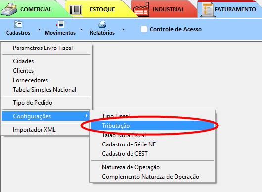

# Cadastro de CEST

Para cadastrar um novo código CEST, va em:
> "Faturamento » Cadastro » Configurações » Cadastro CEST"  

  

Agora vamos *inserir* o código no sistema:  
  

Após feito o cadastro, temos que ir no [cadastro de tributação](cadtribu.md) escolher qual tributação/produto(NCM) pretendo adicionar o código **CEST**:  
  

Localizar no [cadastro de tributação](cadtribu.md), qual **NCM** você pretende e/ou precisa colocar o código **CEST** correspondente, assim encontrado, selecionar o código **CEST**:  
  

Após selecionado o código correto, dar *TAB* até ir para a próxima linha ou clicar em *GRAVAR*.  

Feito este procedimento já vai estar adicionado o código **CEST** para o produto(NCM) e assim já vai estar configurado para cumprir a determinação.
