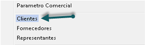
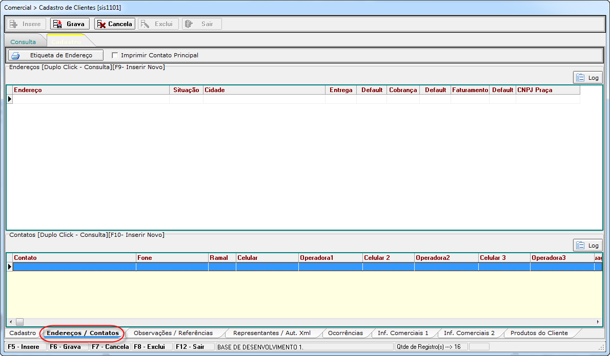

# Cliente
## Cadastrando Cliente

Para se inserir um novo cliente, você deve ir por um destes caminhos 
> “COMERCIAL » CADASTROS » CLIENTES”  
> “FATURAMENTO » CADASTROS » CLIENTES”  
> “RECEBER » CADASTROS » CLIENTES”  

  
  

Irá abrir a seguinte tela:
  

Clique no botão *Insere*, o sistema vai te direcionar para a aba de Cadastro:
  

Preencha devidamente os campos de acordo com os dados do cliente, alguns campos são obrigatórios, dependendo do Tipo de Cliente. Assim que finalizar o cadastro, aperte no botão *Grava*, caso não tenha preenchido algum campo obrigatorio, o sistema vai te avisar de qual campo falta preencher.

---

## Cadastrando de Endereço do Cliente

Após terminar de digitar os dados da Aba Cadastro, vamos para a aba de *Endereços/Contatos*:  
  

De um duplo clique dentro de Endereço  
  

Vai abrir a seguinte Tela:  
  

Clique no botão *Insere*, abrirá a seguinte tela para a pesquisa de *CEP*:  
  

Digite o endereço ou cep, e aperte *LOCALIZAR*.  
Localizar o endereço correto, selecione ele e aperte *Carregar*, como na imagem abaixo:  
  

Após isso virá a confirmação.  
 

Selecione para qual Status seria este endereço, como na imagem abaixo  
  

---
## Incluir Representante no Cliente  
Para incluir um representante ao cadastro do cliente, acesse:  
[Incluindo Representante no Cliente](cadrepre/#incluir-representante-no-cliente)  

---

## Grade Separada na NFe por Cliente

Acesse o cadastro de clientes, você deve ir por um destes caminhos 
> “COMERCIAL » CADASTROS » CLIENTES”  
> “FATURAMENTO » CADASTROS » CLIENTES”  
> “RECEBER » CADASTROS » CLIENTES”  

  

Na tela de clientes, localiza o cliente que deseja e dê dois cliques para abrir o cadastro do mesmo:  
  

No cadastro do cliente, vai até a aba observação/Referências:  
  

Altera as informações em destaque conforme o quadro abaixo:  
  

Feito isso, quando for fazer o faturamento para esse cliente, vai sair o produto separado por grade, item por item.
