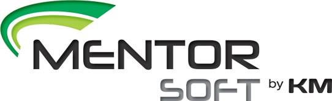

 
 
 

> Desenvolvido pela <a href="http://www.kmsistemas.com.br/" target="_blank">KM Sistemas</a>, o Mentor Soft é um sistema de gestão completo, criado para atender as pequenas, médias e grandes empresas.

> Nosso sistema é composto por módulos integrados, no qual permitem que o usuário realize diversas operações, desde o cadastro do cliente até o relatório completo de resultados.

> É o controle de toda a sua empresa, num único lugar.

---
## Conheça um pouco do nosso sistema:

> Neste módulo encontramos todas as funções relativas a venda do seu produto.     
> Aqui, realizamos o cadastro do seu cliente, tipo de pedido, produto e etc.     
> Para saber mais, <a href="modulos/comercial/"> clique aqui.</a>
          
                                                                                 
       

> No módulo estoque, o usuário terá total controle sobre os produtos disponíveis, sejam eles matéria-prima ou acabados.  
> Para saber mais, <a href="modulos/estoque/"> clique aqui.</a>
  

> O módulo industrial permite que o usuário registre todas as informações do produto, a fim de controlar a produção da empresa.   
> Para saber mais, <a href="modulos/industrial/"> clique aqui.</a>

> Um dos módulos mais importantes para o usuário, pois aqui será realizado todo o processo de faturamento (NF-e ou NFC-e).          
> Para saber mais, <a href="modulos/faturamento/"> clique aqui.</a>

> GRH é a sigla utilizada para Gestão de Recursos Humanos.  
Este módulo foi criado para facilitar as funções do setor de RH, pois permite o controle total de todos os colaboradores.  
> Para saber mais, <a href="modulos/grh/"> clique aqui.</a>

> No módulo pagar, você terá acesso aos títulos pendentes e quitados.   
Aqui, você tem total controle dos vencimentos e valores a serem pagos.   
> Para saber mais, <a href="modulos/pagar/"> clique aqui.</a>

> O módulo receber, permite a emissão, visualização e controle dos títulos vencidos e recebidos.  
> Para saber mais, <a href="modulos/receber/"> clique aqui.</a>

> Aqui, você terá maior controle sobre a gestão financeira de sua empresa, com amplo acesso a controle de movimentações, fluxo de caixa e demonstrativos de resultados.   
> Para saber mais, <a href="modulos/tesouraria/"> clique aqui.</a>

> CT-e é a sigla utilizada para Conhecimento de Transporte Eletrônico, que corresponde ao documento fiscal emitido pelas transportadoras de carga para informar as mercadorias entre a localidade de origem e destinatário.  
> Neste módulo, o usuário conseguirá emitir de maneira simples, este documento.   
> Para saber mais, <a href="modulos/cte/"> clique aqui.</a>
<!-- 

> MDF-e é a sigla para Manifesto Eletrônico de Documentos Fiscais. Em resumo, é o documento emitido e armazenado eletronicamente, para vincular os documentos fiscais transportados na carga.  
> No módulo MDF-e, o usuário poderá emitir este documento de maneira ágil.  
> Para saber mais, <a href="modulos/mdfe/"> clique aqui.</a> -->

---
KM Sistemas       
Vamos crescer juntos!