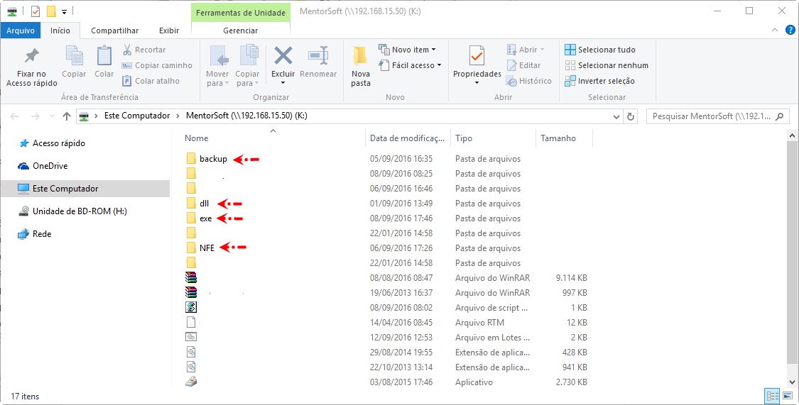

# Instalação do sistema  

## Como instalar o Sistema MentorSoft.
Nesse passo a passo, estaremos ensinando a como fazer a instalação do sistema em uma máquina qualquer.  
Para continuar, precisaremos de acesso ao servidor.  

Você deve:  
> Mapear Unidade de Rede para a pasta do sistema  utilizando a letra K.  
Após a conclusão do mapeamento, ao acessar o mapeamento (K:\) deve encontrar as pastas  
>> - Backup  
>> - DLL  
>> - EXE  
>> - NFE  

  

No seu C:\ crie uma pasta chamada **MentorSoft** dentro dessa pasta deve ficar da seguinte forma:  
> Backup – Pasta padrão de backup do sistema  
>> - DLLs do Backup  
>> - EXEs backup  

> EXE – Executáveis do sistema  
>> - MentorSoft.exe  
>> - sisKM.ini  
>> - Arquivos ini para emissão da nota  

Vá no servidor (K:\) em **K:\exe** copie os arquivos **MentorSoft.exe** e **sisKM.ini** e cole em **C:\MentorSoft\exe**;  
Logo em seguida vá em **K:\DLL** copie todos os arquivos e cole em uma das seguintes pastas:  
> Para Windows 32 Bits (x86):  
>> - “C:\Windows\System32”  

> Para Windows 64 bits (x64):  
>> - “C:\Windows\SysWOW64”  

Se o usuário que utilizará máquina for responsável de backup, você precisa configurar a mesma para que o faça, vá em ** K:\backup**, copie todos os arquivos que não contenham a extensão **.backup** e cole em **C:\MentorSoft\Backup**

Okay, seu sistema está instalado e deve funcionar, vá na pasta **C:\MentorSoft\exe** e crie um atalho do **MentorSoft.exe**.  

--- 

## Configurando para Emissão de Nota  

`Em Breve`